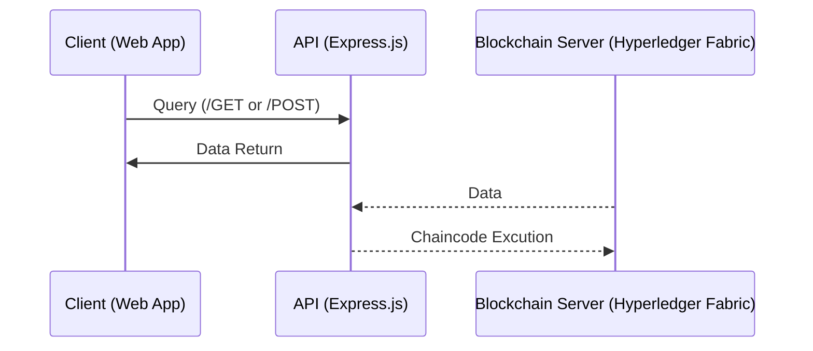

## FoodChain

A supply chain transparency app to enhance agriculture.

Project Architecture:

### Find our work:
- [Planning Docs](/Spec.md) (technical specifications and requirements) 
- [Code]()
    - [Blockchain Backend](/Backend/)
    - **WIP** [API]()
    - **WIP** [UI/frontend]()
- [Testing]()
    - Integration tests
    - Unit tests
- [Reflection]() (What can we add?)
