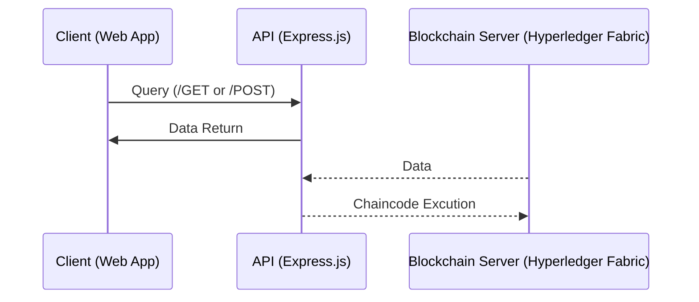

## FoodChain

A supply chain transparency app to enhance agriculture.

Project Architecture:

### Find our work:
- [Planning Docs](/Spec.md) (technical specifications and requirements) 
- [Code]()
    - [Blockchain Backend](/Backend/)
    - **WIP** [API]()
    - **WIP** [UI/frontend]()
- [Testing]()
    - Integration tests
    - Unit tests
- [Reflection]() (What can we add?)

An International hackathon for 12-18 year old high schooler and middle schoolers hosted by Hack Club, the world's largest open-source student organization, is happening in Seattle.

Scrapyard Seattle is on March 15th-16th!

Free food🍕 and Tech SWAG🧢 will be provided. 
Sign up: https://scrapyard.hackclub.com/seattle

Venue: (given out to participants)
